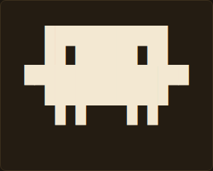

# SIDEKICK

*Sidekick Is Dynamic Entity Kit Crafting Kaiju*

A themeable terminal-art creature you can drop into any web project — plain HTML/JS, or
React.

**[Try the live playground →](https://chrisrrowland.github.io/sidekick-kaiju/)**



<!-- The character art is Unicode block-drawing glyphs (▘▝▖▗▛▜▙▟), which render
     inconsistently across fonts — see the "Known gotchas" note in CLAUDE.md. A rendered
     screenshot avoids that on GitHub's markdown viewer instead of an inline code block. -->

## See it live

The fastest way to explore Sidekick — browse the available characters and poses, try
theming live, and copy working code for your own project — is the playground, hosted at
**https://chrisrrowland.github.io/sidekick-kaiju/**.

To run it locally against your own working copy instead (e.g. while developing a new
character or pose):

```sh
pnpm install
pnpm run playground
```

Opens at http://localhost:5173 with hot reload.

## Install

Not yet published to npm. For now, install directly from this repo (a `prepare` script
builds `dist/` automatically when installed this way):

```sh
npm install github:chrisrrowland/sidekick-kaiju
```

Once published, this section will show `npm install <package-name>` instead.

`sidekick-kaiju` has no runtime dependencies. `sidekick-kaiju/react` treats React as an
optional peer dependency — only install it if you use the React entry point.

## Quick start

**Vanilla / any framework:**

```js
import { getCharacter, getPose, buildRenderModel, renderToElement } from "sidekick-kaiju";
import "sidekick-kaiju/styles.css";

const character = getCharacter("monster");
const model = buildRenderModel(getPose(character, "base").frames[0], character.legend);
renderToElement(model, document.getElementById("app"));
```

This assumes a bundler (Vite, webpack, esbuild, etc.) that resolves the
`"sidekick-kaiju"` specifier. For a build-free page, import from the installed package's
relative path instead — see [`examples/vanilla.html`](./examples/vanilla.html).

**React:**

```tsx
import { Sidekick } from "sidekick-kaiju/react";
import "sidekick-kaiju/styles.css";

<Sidekick character="monster" />;
```

See [`examples/react-usage.md`](./examples/react-usage.md) for poses, theming, and
animation.

## How it works

A **character** is a small registry of named **poses** — the playground's character
picker always shows the current full roster. Each pose is one or more **frames** of
hand-drawn Unicode-glyph art, optionally animated by looping through frames on a timer.
Every part of a character (body, eyes, legs, ...) is tagged via a `legend`, so you can
theme parts independently without touching the art itself.

## Theming

Two ways to theme, use either or both:

- **CSS custom properties** — `--sidekick-color`, `--sidekick-bg`, `--sidekick-font-family`,
  `--sidekick-font-size`, `--sidekick-line-height`, plus per-slot overrides like
  `--sidekick-eyes-color`. Set via the `theme` prop / `applyTheme()`, or on any ancestor.
- **`classNames` slot map** — pass classes your app already owns (e.g.
  `{ eyes: "your-class" }`) instead of inventing new ones. Every part is also tagged
  `data-slot="<name>"`, so attribute selectors work with zero new classes at all.

## API reference

The full API — every export, generated straight from its source doc comment — lives in
the playground's `[ api ]` panel, so it can't drift out of date with a hand-maintained
list here. The essentials: `getCharacter`/`getPose`, `buildRenderModel`,
`renderToElement`/`renderToHTMLString`, `animatePose` (vanilla), and
`<Sidekick>`/`useSidekick`/`useSidekickPose` (React).
